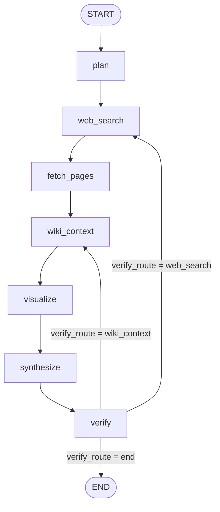

# Search agent LangGraph

Compiled in `search_agent.graph.builder.build_compiled_graph` with a LangGraph **checkpointer** (Postgres or in-memory). Thread id lives in `config.configurable`.

## Flow

### Linear path (happy path)

1. `**plan**` — LLM JSON: `need_web`, `need_wiki`, `need_chart`, `wiki_query`, etc.
2. `**web_search**` — Brave / DuckDuckGo; merges into `web_results` (and honors `pending_web_query` on retries).
3. `**fetch_pages**` — Parallel HTTP fetch of top URLs from `web_results` → `page_extractions` (HTML → text, tables flattened).
4. `**wiki_context**` — Wikipedia summary when `need_wiki` or pending wiki refinement.
5. `**visualize**` — Optional chart PNG in `chart_png_base64` when `need_chart`.
6. `**synthesize**` — LLM JSON answer + citations from web snippets, **fetched page excerpts**, and wiki.
7. `**verify`** — LLM quality check; sets `verify_route` to continue retrieval or finish.

### Retry edges (`verify`)

| `verify_route` (state) | Next node      | Notes                                                                                              |
| ---------------------- | -------------- | -------------------------------------------------------------------------------------------------- |
| `web_search`           | `web_search`   | Re-runs **web_search → fetch_pages → wiki_context → visualize → synthesize → verify**.             |
| `wiki_context`         | `wiki_context` | Skips **fetch_pages** for that hop; refreshes wiki only, then **visualize → synthesize → verify**. |
| `end`                  | `END`          | Done.                                                                                              |

Verification stops forcing more retrieval after `**verify_retry_count`** reaches the cap (see `verify_node`).

## State shape (`SearchAgentState`)

| Area         | Keys                                                                                                                                        |
| ------------ | ------------------------------------------------------------------------------------------------------------------------------------------- |
| Input / plan | `query`, `need_web`, `need_wiki`, `need_chart`, `plan_reason`, `wiki_query`                                                                 |
| Web          | `web_results`, `page_extractions`                                                                                                           |
| Wiki         | `wiki_title`, `wiki_summary`, `wiki_url`                                                                                                    |
| Artifacts    | `chart_png_base64`, `final_answer`, `citations`                                                                                             |
| Verify loop  | `verify_route`, `verify_retry_count`, `verify_quality_score`, `verify_reason`, `verify_feedback`, `pending_web_query`, `pending_wiki_query` |
| Accumulators | `messages` (reducer), `run_trace` (reducer)                                                                                                 |

## Runtime services (`config.configurable`)

Passed from the FastAPI route into the graph, not stored on `SearchAgentState`:

- `thread_id`
- `llm`, `model`
- `duckduckgo`, `page_fetch`, `wikipedia`, `visualization`

